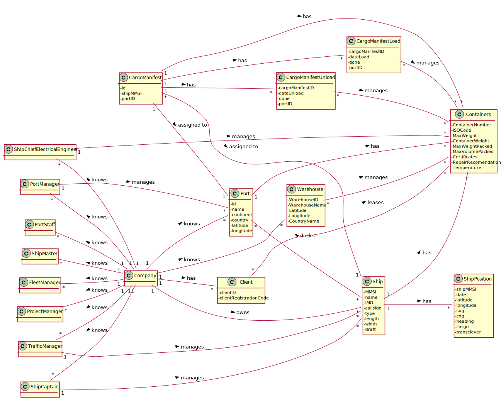
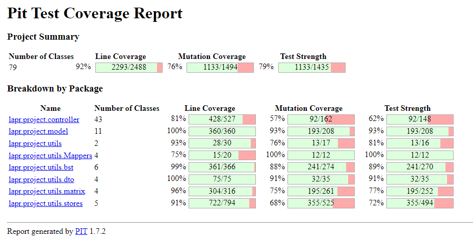

## Problem Statement

A Cargo shipping company requires a software system to handle their logistics. This company operates through land and sea, across different continents and has several warehouses spread along the world

## Domain Model

## Relational Model

## Project Coverage
